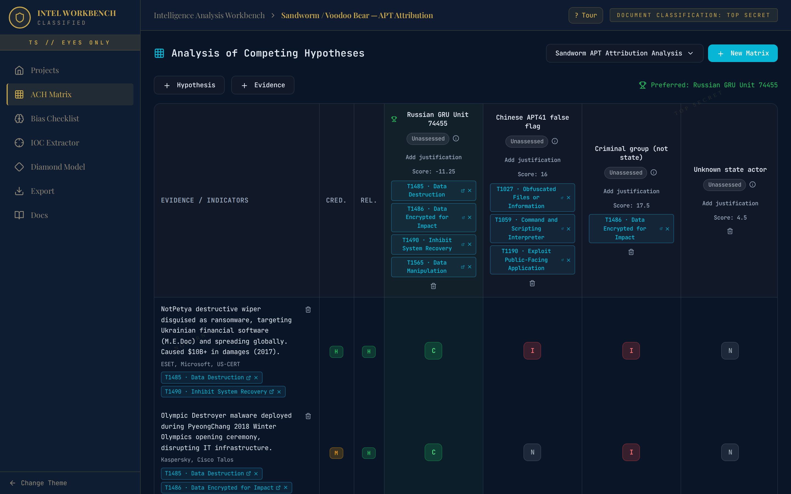
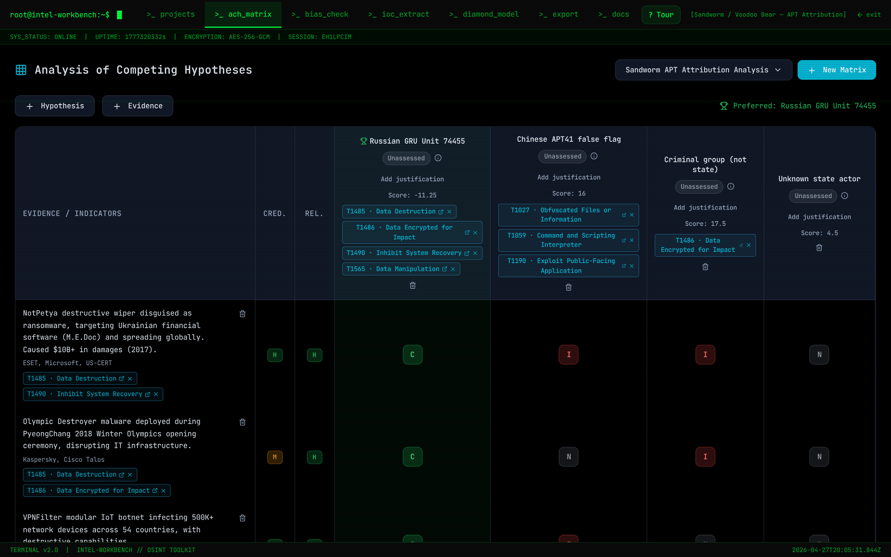
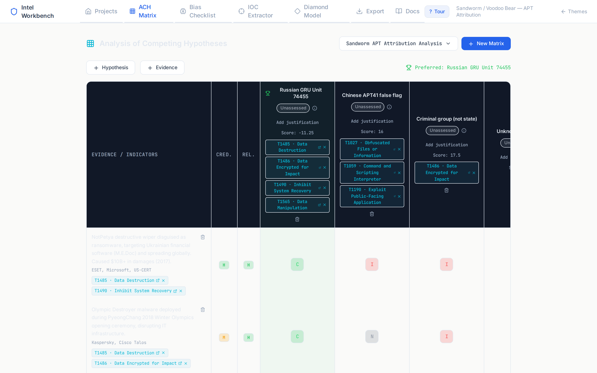
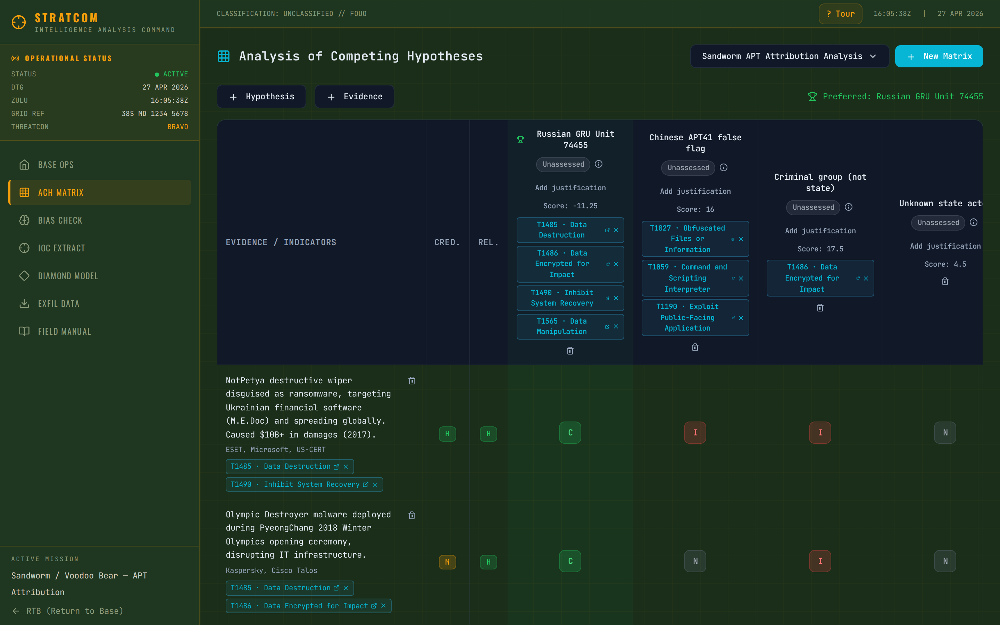
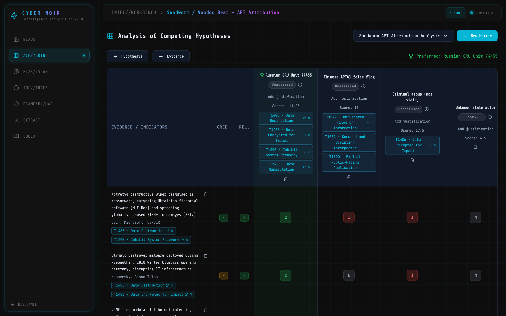
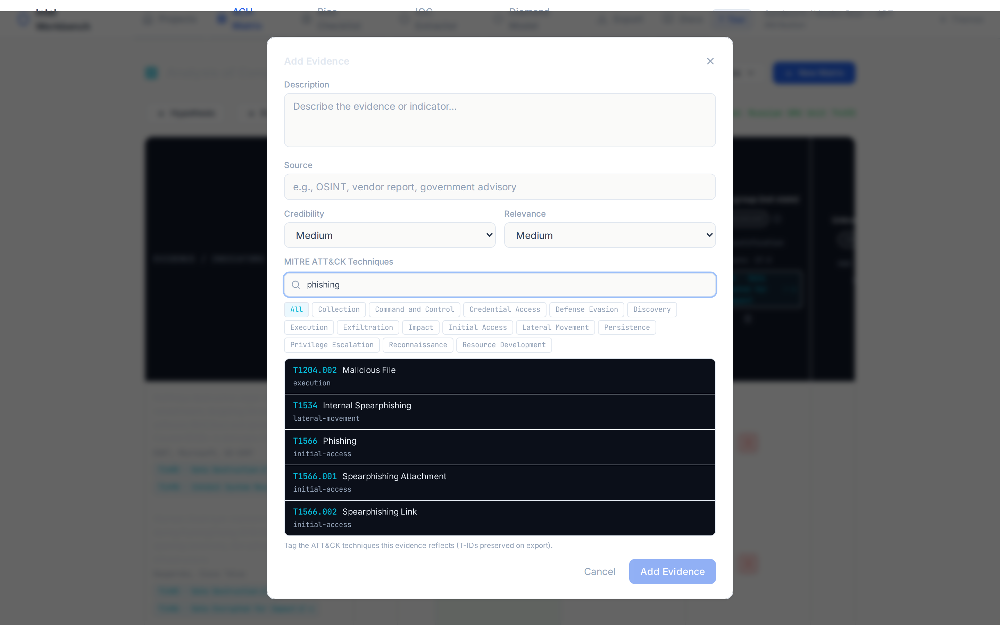

<p align="center">
  <a href="https://intel-workbench.vercel.app"></a>
  
  
  
  
  
  
  
</p>

# 🛡️ Solomon's Intel Workbench

**Structured analytic techniques for cyber threat intelligence. Built for the modern analyst.**

Intel Workbench is an interactive Analysis of Competing Hypotheses (ACH) tool that brings rigorous intelligence methodology to the browser. Score evidence against hypotheses, map findings to MITRE ATT&CK, identify cognitive biases, and export structured assessments. Zero backend, full offline capability, and eight distinct visual themes.

> **Try it now → [intel-workbench.vercel.app](https://intel-workbench.vercel.app)**


---

## ✨ Features

- **ACH Matrix** : Interactive evidence-vs-hypothesis grid with consistency ratings (C/I/N/NA), weighted scoring, and automatic preferred-hypothesis identification
- **MITRE ATT&CK Tagging** : Tag evidence and hypotheses with techniques from the Enterprise ATT&CK matrix (691 techniques, 14 tactics). Searchable by ID, name, or tactic. Vendored locally so the workbench stays offline-first
- **Cognitive Bias Checklist** : Heuer & Pherson taxonomy with 12 biases across Cognitive, Analytical, and Social categories; track mitigation notes per bias
- **Score Visualization** : Real-time normalized score bars showing hypothesis support levels with color-coded confidence indicators
- **ICD 203 Estimative Language** : Pick a likelihood band ("almost no chance" through "almost certainly") with the canonical 1-5%/5-20%/.../95-99% ranges per ODNI Analytic Standards; the preferred hypothesis displays a probability ribbon on the matrix and in Markdown exports
- **Evidence Weighting** : Credibility and relevance ratings (High/Medium/Low) that feed into weighted inconsistency scores
- **Export & Import** : Full JSON export/import for backup and sharing; Markdown export for report generation (includes ATT&CK technique IDs)
- **8 Visual Themes** : Langley, Terminal, Analyst's Desk, Stratcom, Cyber Noir, Casefile Atlas, Ops Floor, and Blacksite Minimal
- **In-App Guided Tour** : First-visit walkthrough powered by driver.js highlighting every major feature
- **Built-In Documentation** : Comprehensive help page covering ACH methodology, scoring, bias awareness, and keyboard shortcuts
- **Offline-First** : All data persisted in localStorage; works without any server
- **Keyboard Accessible** : Full keyboard navigation across the matrix grid

---

## 🏗️ Architecture

Intel Workbench is a **single-page React application** with no backend dependencies:

```
Browser
  └─ React 18 (SPA, React Router v6)
       ├─ Zustand Store ← persist middleware → localStorage
       ├─ ThemeContext (per-variant color tokens)
       ├─ Pages: Home / ACH / Bias / Export / Docs
       └─ 8 Variant Layouts (lazy-loaded)
```

- **State Management:** Zustand with `persist` middleware writes to `localStorage` under the key `intel-workbench-projects`
- **Routing:** React Router v6 with nested variant routes (`/v1/*`, `/v2/*`, …, `/v8/*`, `/default/*`) and a variant picker at `/`
- **Theming:** `ThemeContext` provides color tokens per variant; components read them via `useTheme()`
- **Code Splitting:** Variant layouts are `React.lazy()` loaded to keep the initial bundle small

---

## 🚀 Quick Start

### Prerequisites

- **Node.js** ≥ 18
- **npm** ≥ 9

### Install & Run

```bash
git clone https://github.com/solomonneas/intel-workbench.git
cd intel-workbench
npm install
npm run dev
```

Open [http://localhost:5173](http://localhost:5173) in your browser.

### Build for Production

```bash
npm run build
npm run preview
```

### Run Tests

```bash
npm test         # vitest, single run
npm run test:watch
npm run typecheck
```

CI runs typecheck + tests + production build on every push (`.github/workflows/ci.yml`).

---

## 🛠️ Tech Stack

| Layer | Technology | Purpose |
|-------|-----------|---------|
| **Framework** | React 18 | Component UI |
| **Language** | TypeScript 5 | Type safety |
| **Styling** | Tailwind CSS 3 | Utility-first CSS |
| **State** | Zustand 4 | Global state + persistence |
| **Routing** | React Router 6 | Client-side navigation |
| **Icons** | Lucide React | Consistent icon set |
| **Bundler** | Vite 7 | Dev server + build |
| **Tour** | driver.js 1.3 (CDN) | Guided onboarding |

---

## 📁 Project Structure

```text
intel-workbench/
├── index.html                 # Entry point + CDN links
├── package.json
├── vite.config.ts
├── tailwind.config.js
├── tsconfig.json
├── public/
│   └── vite.svg
└── src/
    ├── main.tsx               # React root
    ├── App.tsx                # Router + variant routes
    ├── index.css              # Tailwind layers + component classes
    ├── components/
    │   ├── ach/
    │   │   ├── ACHMatrix.tsx  # Interactive hypothesis matrix
    │   │   └── ACHScoreBar.tsx
    │   ├── bias/
    │   │   └── BiasChecklist.tsx
    │   ├── layout/
    │   │   └── AppShell.tsx   # Default sidebar layout
    │   └── GuidedTour.tsx     # driver.js onboarding tour
    ├── contexts/
    │   └── ThemeContext.tsx    # Theme color provider
    ├── data/
    │   ├── biasData.ts        # Cognitive bias catalog
    │   └── sampleProject.ts   # Sandworm sample data
    ├── pages/
    │   ├── HomePage.tsx       # Project list & creation
    │   ├── ACHPage.tsx        # Matrix workspace
    │   ├── BiasPage.tsx       # Bias review
    │   ├── ExportPage.tsx     # JSON/Markdown export
    │   ├── DocsPage.tsx       # In-app help & documentation
    │   └── VariantPicker.tsx  # Theme selector landing
    ├── store/
    │   └── useProjectStore.ts # Zustand store (persisted)
    ├── types/
    │   └── index.ts           # TypeScript interfaces
    ├── utils/
    │   ├── achScoring.ts      # Scoring algorithms
    │   ├── id.ts              # ID generator
    │   └── useBasePath.ts     # Variant-aware navigation
    └── variants/
        ├── v1/Layout.tsx      # Langley (intel agency)
        ├── v2/Layout.tsx      # Terminal (hacker)
        ├── v3/Layout.tsx      # Analyst's Desk (clean)
        ├── v4/Layout.tsx      # Stratcom (military)
        ├── v5/Layout.tsx      # Cyber Noir (cyberpunk)
        ├── v6/Layout.tsx      # Casefile Atlas (evidence desk)
        ├── v7/Layout.tsx      # Ops Floor (live cell)
        └── v8/Layout.tsx      # Blacksite Minimal (brutalist)
```

---

## 🎨 8 Variants

Each variant wraps the same core pages in a unique visual identity:

| Variant | Theme | Aesthetic |
|---------|-------|-----------|
| **v1 : Langley** | Intelligence Agency | Dark navy, gold accents, serif type, classified stamps |
| **v2 : Terminal** | Hacker / OSINT | Pure black, matrix green, scanline overlay, monospace |
| **v3 : Analyst's Desk** | Clean Professional | Light backgrounds, blue accents, content-first layout |
| **v4 : Stratcom** | Military Command | OD green, amber accents, grid patterns, military time |
| **v5 : Cyber Noir** | Cyberpunk | Neon cyan + magenta, glow effects, glass-morphism |
| **v6 : Casefile Atlas** | Evidence Desk | Warm paper, red-thread evidence board, serif-heavy dossiers |
| **v7 : Ops Floor** | Live Cell | Dense command-center layout, teal signal lines, amber status blocks |
| **v8 : Blacksite Minimal** | Brutalist | Severe monochrome, acid-lime emphasis, hard-edged controls |

<p align="center">
  
  
</p>
<p align="center">
  
  
</p>
<p align="center">
  
</p>

All variants share the same Zustand store and page components. Switching themes is instant : just navigate back to the variant picker at `/`.

---

## 🎯 MITRE ATT&CK Integration

Tag evidence and hypotheses with techniques from the **MITRE ATT&CK Enterprise** matrix. Search by technique ID (`T1059`), name (`Phishing`), or filter by tactic (Initial Access, Execution, Lateral Movement, …). Tags persist in JSON exports and are rendered as clickable references in Markdown reports.



The full ATT&CK Enterprise dataset (691 techniques, 14 tactics) is vendored at `src/data/attack-enterprise.json` and lazy-loaded so the initial bundle stays small. To refresh after a new ATT&CK release:

```bash
curl -sL https://raw.githubusercontent.com/mitre/cti/master/enterprise-attack/enterprise-attack.json \
  | jq -f scripts/slim-attack.jq > src/data/attack-enterprise.json
```

---

## 📊 ACH Methodology

**Analysis of Competing Hypotheses** (ACH) is a structured analytic technique developed by Richards J. Heuer Jr. at the CIA. Instead of seeking evidence to *confirm* a preferred hypothesis, ACH forces analysts to:

1. **Enumerate all reasonable hypotheses**
2. **List all significant evidence and arguments**
3. **Rate each evidence item against each hypothesis** as Consistent (C), Inconsistent (I), Neutral (N), or Not Applicable (NA)
4. **Score inconsistencies** : the hypothesis with the *fewest* weighted inconsistencies is the most supported
5. **Identify and mitigate cognitive biases** that might distort the analysis

The key insight: **disprove rather than prove.** A single strong inconsistency can eliminate a hypothesis, while consistent evidence alone cannot confirm one.

### Scoring Formula

```text
Score = Σ (weight × rating_value)

where:
  rating_value: I = +2, N = 0, C = −1
  weight:       credibility_multiplier × relevance_multiplier
  multipliers:  High = 1.5, Medium = 1.0, Low = 0.5
```

Lower (more negative) scores indicate stronger support. The hypothesis with the lowest score is flagged as **preferred**.

---

## 📄 License

MIT : see [LICENSE](LICENSE) for details.
