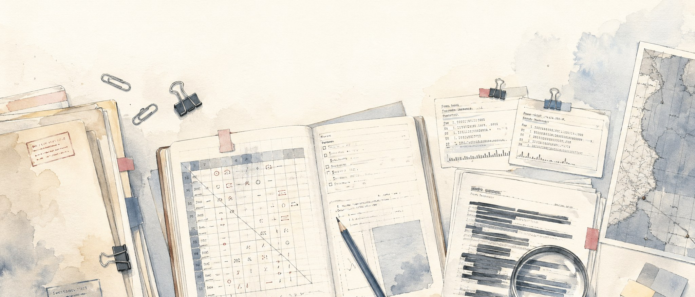
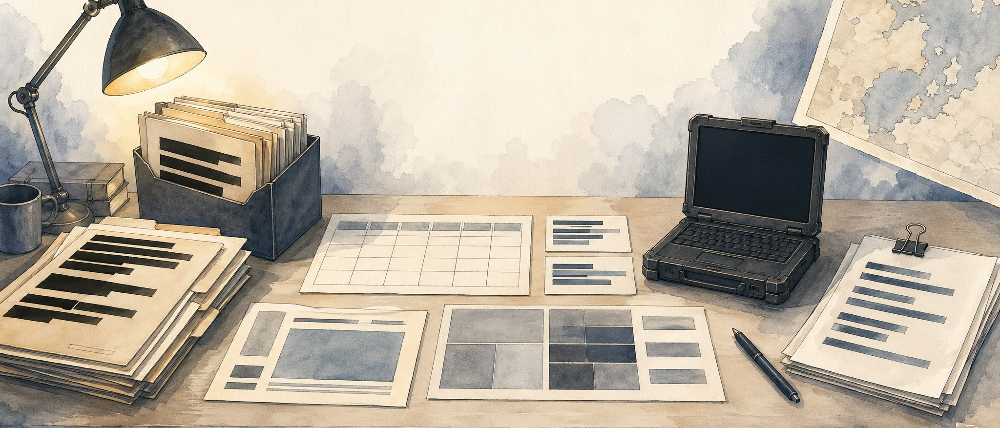

# Repo Image Options

Three lighter watercolor hero image options for the repository. These keep the repo-art direction but pull away from dense cyber graph visuals: lighter paper palette, cleaner CIA-style cyber intelligence artifacts, no mascot, no animals, no people, no official seals, and no embedded title text.

## 1. Light Cyber Analysis Desk

A clean analyst desk with dossiers, redacted reports, source notes, packet traces, and ACH-style evidence cards.

## 2. Light Analyst Workbook

An analytic workbook spread with redacted files, matrix sheets, data slips, a map corner, and restrained cyber-intel cues.

## 3. Light Classified Cyber Desk

A calmer classified cyber desk with folders, abstract packet-capture bars, blank matrix cells, and soft watercolor space.

