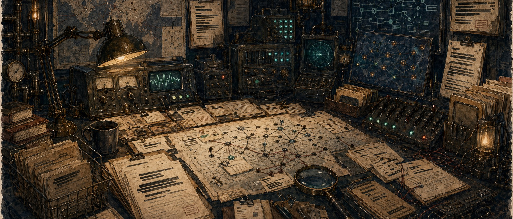
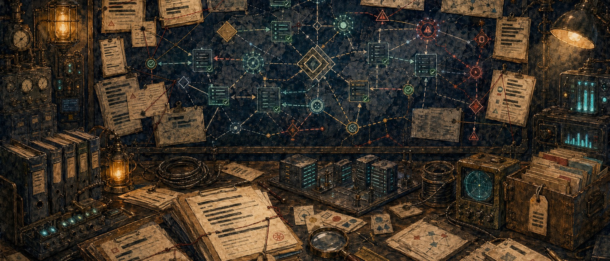
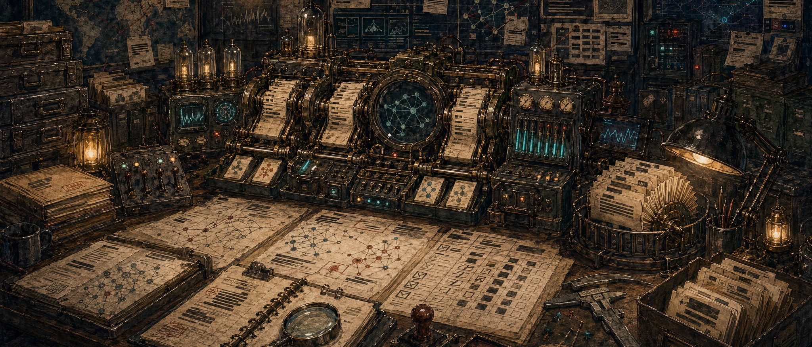

# Repo Image Options

Three house-style hero image options for the repository. These keep the current repo-art direction: wide watercolor/ink illustration, dark workshop palette, brass and teal technical detail, paper clutter, and no embedded title text.

For Intel Workbench, the imagery is CIA-style cyber intelligence rather than OpenClaw. No lobster, mascot, official CIA seal, government logo, real insignia, people, or readable title text is included.

## 1. Cyber Analysis Desk

A classified cyber analysis desk with dossiers, redacted source notes, network traces, intelligence maps, and ACH-style evidence cards.

## 2. Cyber Infrastructure Board

A cyber infrastructure relationship board using abstract nodes, route lines, source packets, confidence markers, and Diamond Model-style geometry.

## 3. Correlation Engine

A secure cyber intelligence lab with a mechanical evidence-correlation engine, IOC cards, redaction stamps, and signal-processing dials.

