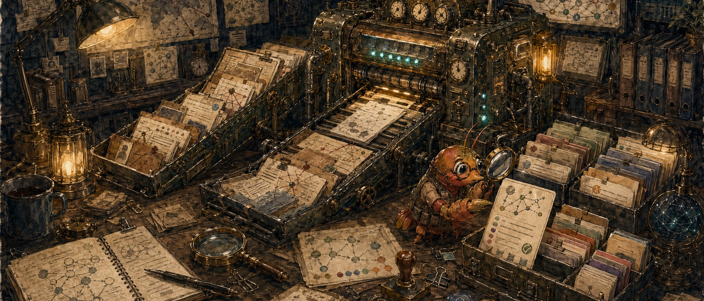
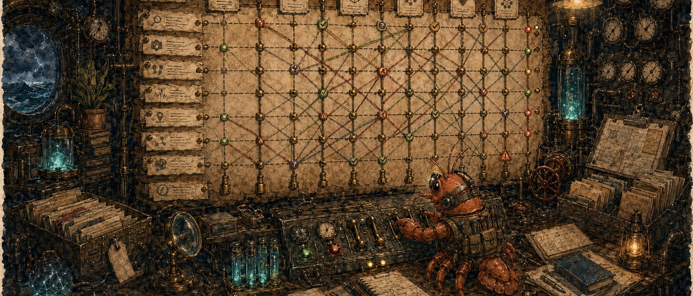
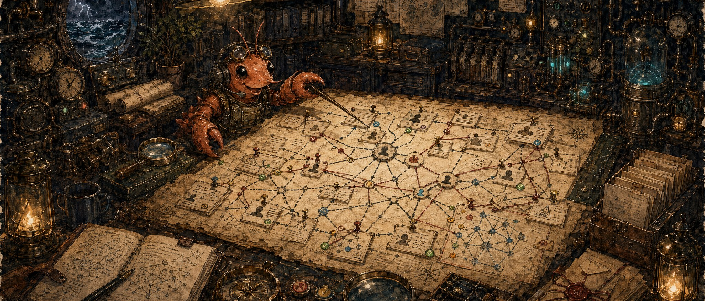

# Repo Image Options

Three house-style hero image options for the repository. These match the current Content Guard, solostack, Hotwash, and n8n Ops MCP banner direction: wide watercolor/ink illustration, dark workshop palette, warm brass light, technical clutter, tiny crustacean helper, and no embedded title text.

## 1. Evidence Engine

A brass evidence machine ingests dossiers, maps, source notes, and index cards, then outputs organized hypothesis cards.

## 2. Hypothesis Matrix

A steampunk planning wall turns ACH into a physical analyst board with gauges, confidence markers, pins, and evidence rows.

## 3. Intel Cartography

A parchment relationship-map table connects threat actors, infrastructure, IOCs, and Diamond Model-style entities.

