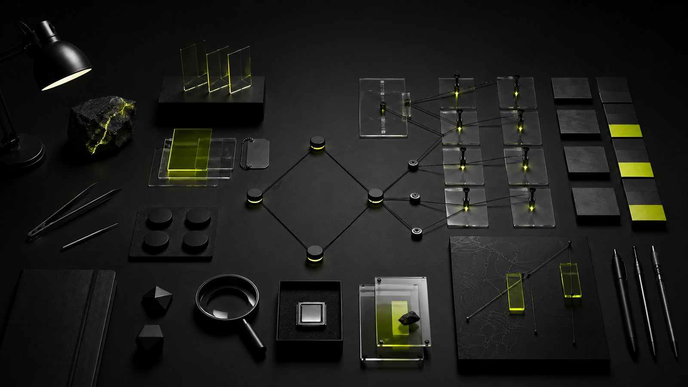

# Repo Image Options

Three hero image options for the repository. None of these include readable text, logos, people, or watermarks.

## 1. Casefile Atlas

Warm evidence-desk image with files, source documents, pins, red thread, and analyst desk atmosphere.

## 2. Ops Floor

Dark security-operations image with network graphs, threat-intel panels, and teal/amber monitor light.

## 3. Blacksite Minimal

Stark black product-shot image with acid-lime evidence highlights, abstract matrix blocks, and forensic objects.

