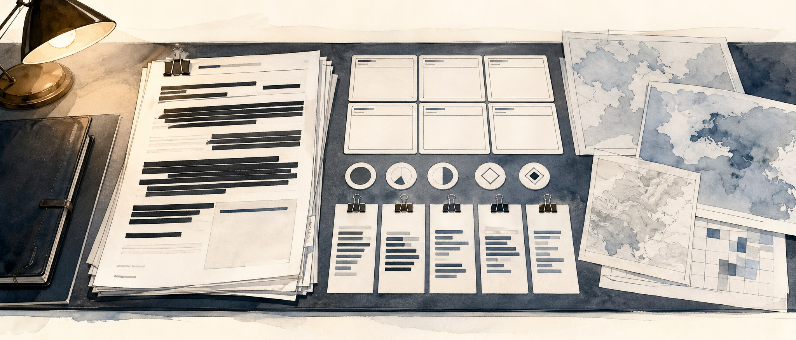

# Repo Image Options

Three lighter watercolor hero image options for the repository. These move the direction toward CIA/Langley-style cyber intelligence: executive briefing packets, redacted source material, analytic confidence artifacts, ACH-style evidence cards, and cyber indicators presented as report evidence rather than dashboard graphics.

No mascot, animals, people, official CIA seal, presidential seal, government logo, real insignia, or embedded title text is included.

## 1. Presidential Briefing Packet

An executive cyber threat assessment packet with redacted source pages, briefing cards, maps, and analytic evidence slips.

## 2. National Cyber Threat Brief

A cleaner classified intelligence desk with source reliability cards, blank ACH matrix cells, IOC slips, and threat assessment folders.

## 3. Executive Threat Estimate

A light watercolor threat estimate layout with redacted documents, analytic judgment cards, matrix sheets, and restrained cyber evidence.

